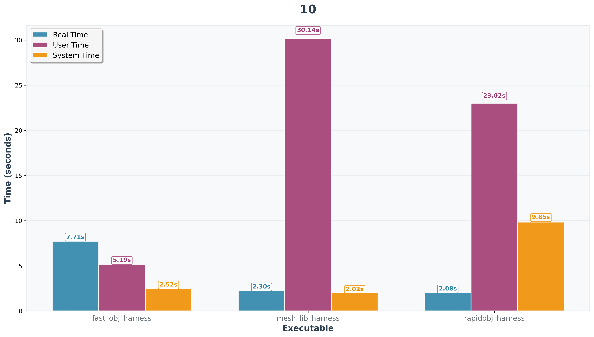
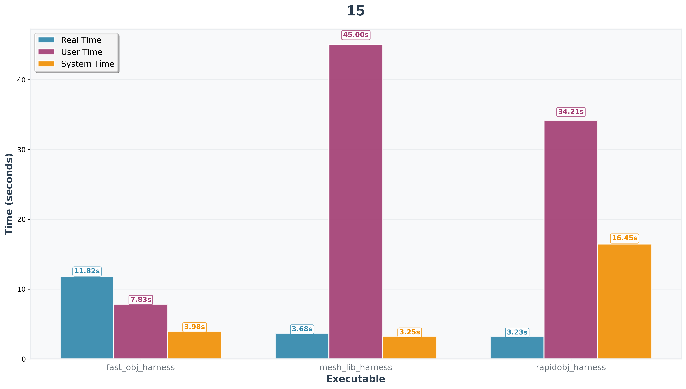
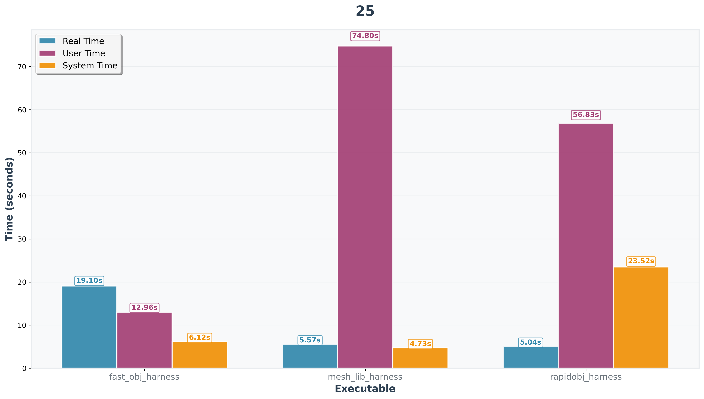

# mesh-lib

## Requirements

- Linux environment
- C++23 (via g++)
- Make

## Installation

1. Clone the repository:
   ```bash
   git clone <repository-url>
   cd mesh-lib
   ```

2. Build the project:
   ```bash
   make
   ```

## Usage

1. Store any obj files you want to test in `data/input/`.
2. Time the parsers:
   ```bash
   bash scripts/timeit.sh
   ```

3. Graph the results:
   ```bash
   python3 scripts/graphit.py
   ```

The resulting data and graphs will then be stored in `data/time/raw` and `data/time/graphs/` respectively.

## Mesh Data Structure

*TODO: Fill out section*

## Performance Analysis

*TODO: Fill out section*

## Comparison with other parsers

*TODO: Fill out zoo specifications (file size exceeded my laptop's memory limit)*

Because testing like this is non-deterministic, the following results are approximations that try to reduce noise by "warming up" memory by doing a few parse rounds before starting the tests, averaging 20+ runs per test, and rejecting outliers via median absolute deviation. All parsers were tested on files created with the tool in `scripts/generateObj.py` and yielded the following results:


See the following per-file data for more detailed times, including a breakdown of time spent in user space vs kernel space (click image to expand):

    


