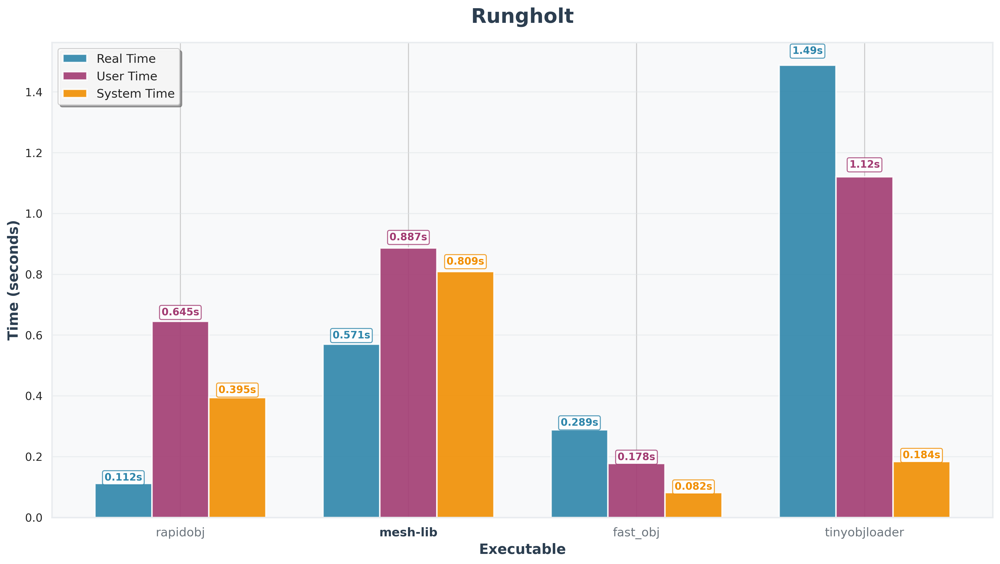

# mesh-lib

## Requirements

- Linux environment
- GCC
- libfmt-dev
- Make

## Installation

1. Clone the repository:
   ```bash
   git clone <repository-url>
   cd mesh-lib
   ```

2. Build the project:
   ```bash
   make
   ```

## Usage

1. Store any obj files you want to test in `data/input/`.
2. Time the parsers (do multiple runs for better accuracy):
   ```bash
   ./data/time/timeit.sh
   ```

3. Graph the results:
   ```bash
   python3 data/time/graphit.py
   ```

The resulting data will then be stored in `data/time/graphs/`.

## Mesh Data Structure

The mesh is represented as a struct containing the following:

- `std::vector<Vertex> vertices`
  - `Vertex` is a struct composed of three `float`s to represent x, y, and z coordinates.
- `std::vector<Texture> textures`
  - `Texture` is a struct composed of two `float`s to represent u (horizontal) and v (vertical) axes.
- `std::vector<Normal> normals`
  - `Normal` is a struct composed of three `float`s to represent x, y, and z coordinates.
- `std::vector<int64_t> vertex_indices`, `std::vector<int64_t> texture_indices`, `std::vector<int64_t> normal_indices`
  - These vectors store the actual index values referenced by faces.
- `std::vector<Face> faces`
  - `Face` is a struct composed of three `Indices` structures (for vertices, textures, and normals). Each `Indices` struct contains a `start` position and `len` count, allowing faces to reference arbitrary n-gons.

Both `vertices` and `faces` are 0-indexed, so the obj input and output correctly handles 1-based indexing in the obj file by adding or subtracting 1 when appropriate. All indices in this representation are positive, so negative indices in obj input are also resolved.

`.mtl` parsing is not yet supported.

## Performance Analysis

Analysis and comparisons were done using the Linux `/usr/bin/time` tool. The test harness loads the obj file into whatever data structure is used to represent the mesh, then returns after freeing memory. Optimizations were chosen based on performance analysis from the following tools:

- `perf stat`
- `perf record` with `perf report` TUI
- `valgrind --tool=callgrind` with `kcachegrind` GUI

Single-threaded optimizations include:

- Using `mmap` with `MAP_POPULATE` to load the file into memory at once
- Using the `fast_float` library instead of `stoi`/`stof` for faster string-to-float conversions
- Using pointers and `std::string_view` everywhere to avoid heap allocations with `std::string`

And for machines supporting parallelism, large files are broken into chunks and parsed in parallel using the same optimizations, then later merged in order once all threads have completed their jobs. Results have shown that the added overhead for managing threads is only really an issue for very small files (less than 1MB), and even then, it is on the order of milliseconds.

Output of `perf record` for a 2.5GB file on the single-threaded implementation (~6.4s):

```bash
# To display the perf.data header info, please use --header/--header-only>
#
#
# Total Lost Samples: 0
#
# Samples: 16K of event 'task-clock:uppp'
# Event count (approx.): 4157000000
#
# Overhead  Command          Shared Object         Symbol                >
# ........  ...............  ....................  ......................>
#
    27.03%  mesh-lib-harnes  mesh-lib-harness      [.] parseLine(Mesh&, s>
    23.05%  mesh-lib-harnes  mesh-lib-harness      [.] fast_float::from_c>
    15.00%  mesh-lib-harnes  mesh-lib-harness      [.] parseIndex(char co>
    14.63%  mesh-lib-harnes  libc.so.6             [.] __memchr_avx2
    12.56%  mesh-lib-harnes  mesh-lib-harness      [.] fast_float::from_c>
     5.21%  mesh-lib-harnes  libc.so.6             [.] __memmove_avx_unal>
     1.27%  mesh-lib-harnes  mesh-lib-harness      [.] importMeshFromObj(>
     1.24%  mesh-lib-harnes  mesh-lib-harness      [.] memchr@plt
```

Output of `perf record` for the same file on the multi-threaded implementation (~3.2s):

```bash
# Total Lost Samples: 0
#
# Samples: 35K of event 'task-clock:uppp'
# Event count (approx.): 8757750000
#
# Overhead  Command          Shared Object         Symbol                >
# ........  ...............  ....................  ......................>
#
    32.71%  mesh-lib-harnes  mesh-lib-harness      [.] parseLine(Mesh&, s>
    19.91%  mesh-lib-harnes  mesh-lib-harness      [.] fast_float::from_c>
    14.87%  mesh-lib-harnes  mesh-lib-harness      [.] parseIndex(char co>
    11.08%  mesh-lib-harnes  libc.so.6             [.] __memmove_avx_unal>
     8.56%  mesh-lib-harnes  libc.so.6             [.] __memchr_avx2
     7.98%  mesh-lib-harnes  mesh-lib-harness      [.] fast_float::from_c>
     2.71%  mesh-lib-harnes  mesh-lib-harness      [.] importMeshFromObjP>
     1.37%  mesh-lib-harnes  mesh-lib-harness      [.] std::thread::_Stat>
     0.75%  mesh-lib-harnes  mesh-lib-harness      [.] memchr@plt
```

This shows that the bottleneck is still the expensive string-to-float conversions in both implementations.

## Comparison with other parsers

These tests were run on a device with the following specifications:

- CPU: Intel Core Ultra 9 185H, 16 cores, 22 threads
- RAM: 32GB, 7467 MT/s
- SSD: 5527 MB/s for 1MiB sequential reads, 2208 MB/s for 1MiB sequential writes

Because testing like this is non-deterministic, the following results are approximations that try to reduce noise by "warming up" memory by doing a few parse rounds before starting the tests, averaging 20+ runs per test, and rejecting outliers via median absolute deviation. All parsers were tested on the following images:

- Stanford Bunny model ([source](https://casual-effects.com/data/), 10MB file, 72K vertices, 144K faces, triangulated)
- Chinese Dragon model ([source](https://casual-effects.com/data/), 72MB file, 439K vertices, 871K faces, triangulated)
- Rungholt Minecraft map ([source](https://casual-effects.com/data/), 270MB file, 2.5M vertices, 3.4M faces, not triangulated)
- Blender 3.0 splash screen ([source](https://download.blender.org/archive/gallery/blender-splash-screens/blender-3-0/), 2.5GB file, 14.4M vertices, 14.3M faces, not triangulated)

   

And yielded the following results:


See the following per-file data for more detailed times, including a breakdown of time spent in user space vs kernel space (click image to expand):

   


